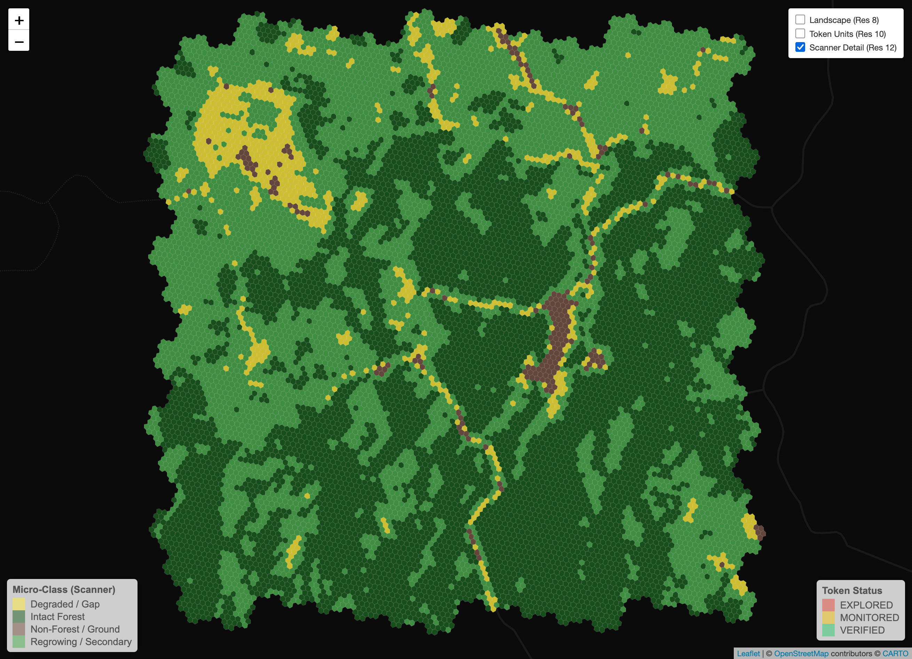

# [[revorest-ray]] (R-Eye) Scanning Engine

**Revorest-Ray** is the high-precision scanning engine of the Revorest protocol. It acts as the "eye" that interprets satellite data into structured, scientifically-validated evidence for the Digital MRV (d-MRV) ledger.



## 🔬 Scientific Foundations
This engine is built upon established forest monitoring and allometric research:

1.  **Pantropical Biomass Allometry (Chave et al., 2014):**
    - Provides the foundation for converting structural tree data (Diameter, Height, Wood Density) into Above-Ground Biomass (AGB). Our model uses satellite proxies to simulate these relationships in tropical Dipterocarp forests.
2.  **Remote Sensing Allometry (Jucker et al., 2017):**
    - Establishes the link between crown architecture (detected via high-res texture and radar) and tree biomass. We use **Standard Deviation (SD)** of Radar VH as a proxy for the "Architectural Axis" of the canopy.
3.  **Global Tree Density Baselines (Crowther et al., 2015):**
    - Provides the reference for "Global Tree Count" expectations. We use these baselines to estimate tree density (trees per hectare) by combining biomass density with canopy heterogeneity metrics.
4.  **Tropical Forest Multi-Sensor Fusion:**
    - Integrating Sentinel-1 (C-Band Radar) for physical structure and Sentinel-2 (Optical) for photosynthetic health (NDVI) to overcome the "saturation effect" common in high-biomass tropical regions.

## ⬢ Why We Use Hexagonal Grid
...

Inspired by the **Civilization** strategy game series, the hexagonal grid (Uber's H3 system) provides several critical advantages for the Revorest protocol:
1. **Uniform Adjacency:** Unlike squares, every neighbor of a hexagon is at the same distance from its center. This makes risk calculations (e.g., fire spread or "buffer risk" for carbon claims) mathematically consistent in all directions.
2. **Organic Representation:** Forest edges, rivers, and terrain boundaries are rarely straight 90-degree lines. Hexagons mimic organic shapes more effectively than rectangular grids, reducing "staircase" artifacts at forest borders.
3. **Hierarchical Scaling:** H3 allows for a nested hierarchy where 1 parent hexagon (Res 10) can contain exactly 49 child hexagons (Res 12). This enables us to maintain a "Single Source of Truth" while scanning at different granularities.
4. **Gamified Logic:** By discretization of the world into hexagons, we turn the planet into a manageable, "playable" interface for forest restoration, making it intuitive for both scientists and users.

## 🗺️ Spatial Strategy: Bottom-Up d-MRV Hierarchy
Instead of a top-down averaging approach, **Ray** uses a high-precision **Bottom-Up** monitoring logic:

- **Scanner Unit (Res 12):** ~300 m². The **Primary Analysis Unit**. All scientific calculations (Biomass, Classification) are performed here to capture sub-pixel dynamics (3 pixels per hex).
- **Token Unit (Res 10):** ~1.5 hectares. The **Ledger Container**. A Token is only "VERIFIED" if >90% of its child units are healthy.
- **Landscape Unit (Res 8):** ~73 hectares. The **Regional Overview** for macro-level reporting.

### 📊 Resolution Benchmark: H3 vs. Sentinel-2
| H3 Level | Area (Approx) | Sentinel-2 Ratio | Use Case |
| :--- | :--- | :--- | :--- |
| **Res 10** | 1.5 Ha | 150 pixels | Legal/Token Container |
| **Res 12** | 300 m² | **3 pixels** | **Analysis Sweet Spot** |
| **Res 13** | 44 m² | 0.4 pixels | Overkill (Redundant) |

## 📊 Data Extraction & Analysis Logic

Our d-MRV engine operates on a hierarchical validation stack:
1.  **Scanner Level (Res 12):** Precision MRV using Sentinel-1/2 fusion.
2.  **Container Aggregation (Res 10):** Collective Integrity (90% threshold for "Verified" status).
3.  **Landscape Synthesis (Res 8):** 100% mathematical sum of underlying verified tokens.

## 🔄 Scanning Workflow

```mermaid
graph TD
    A[01_initialize_h3_grid.R] -->|Generate| B(Res 8, 10, 12 Hierarchy)
    A -->|Verify| A1[01a_validate_h3_grid.R]
    
    B --> C[02_fetch_satellite_data.R]
    C -->|Batch Task| D{Google Earth Engine}
    D -->|Export CSV| E[/rgee/ Folder]
    
    E --> F[02a_process_satellite_data.R]
    F -->|Enrich| G(Hierarchical RDS/GPKG)
    
    G --> H[02b_visualize_satellite_data.R]
    H -->|HTML Map| I(Satellite Evidence Map)
    
    G --> J[03_process_dmrv_logic.R]
    J -->|Biomass/MRV| K(Final d-MRV Result)
```

## 📋 Today's Development Plan
1. **[Script 01] Hierarchical Initialization:** Successfully created Res 8 (Landscape), Res 10 (Token), and Res 12 (Scanner) layers.
2. **[Script 02] Multi-Sensor Fetching:** Implemented robust Batch Extraction for Sentinel-1 & 2 via Google Earth Engine.
3. **[Script 02a/b] Processing & Visualization:** Established a pipeline to link real satellite evidence to hexagons and visualize health layers (NDVI).
4. **[Script 03] Scientific Scoring:** (NEXT) Update the d-MRV logic to incorporate the "Architectural Axis" and detect "Double-Counting" risks.

---
**Lead:** Ardha | **Engine:** Revorest Protocol
